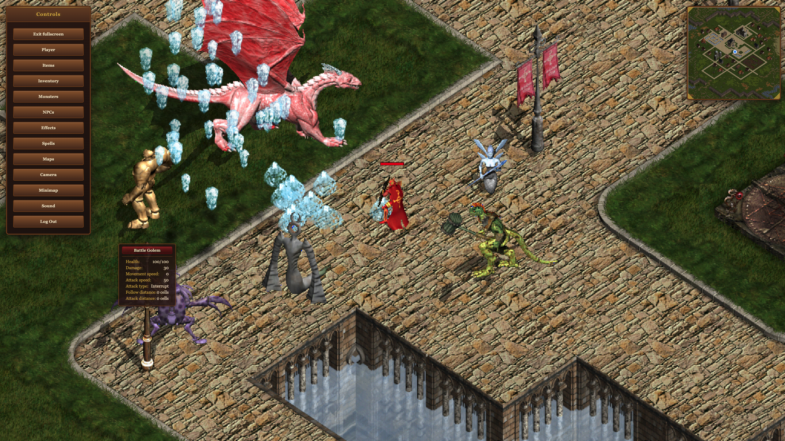

# Helbreath Base Game

[](./LICENSE)
[](https://phaser.io/)
[](https://react.dev/)
[](https://hbexplorer.helbreath.workers.dev/)
[](https://discord.gg/P4tBdGRC3q)

Helbreath Base Game is a browser-based single-player recreation of the classic [Helbreath](https://helbreath.fandom.com/wiki/Helbreath_Wiki) client, built with [Phaser 3](https://phaser.io/) and [React](https://react.dev/), and designed as a foundation for building 2D (MMO)(A)RPG-style projects. It is best thought of as a playable base client or lightweight game framework rather than a complete game.

The repository already includes a substantial amount of core functionality:

- Maps and world rendering
- Monsters and NPCs
- Player character customization
- Grid-based movement
- Spells and visual effects
- Items and inventory
- Basic melee and ranged combat
- Music and audio

The project has been developed heavily with AI assistance and is intentionally kept approachable for AI-assisted workflows and iterative expansion.

Join the [Discord server](https://discord.gg/P4tBdGRC3q) for discussion, questions, and project showcases. If you build something on top of this project, feel free to share it there.

## Demo



Play the live demo here: [hbexplorer.helbreath.workers.dev](https://hbexplorer.helbreath.workers.dev/)

## What This Is / Is Not

This project is:

- A browser-based Helbreath-inspired base client
- A foundation for hobby RPG and MMORPG-style projects
- A practical codebase for experimenting with Helbreath assets, mechanics, and tooling

This project is not:

- A finished standalone game
- A drop-in Helbreath client (has no networking setup or compatibility with C++ server version)

## Why This Project Exists

The goal of this repository is to preserve and modernize a large amount of Helbreath client-side content in a form that is easier to understand, extend, and build on. Instead of starting from scratch with rendering, maps, sprites, effects, UI, and core gameplay systems, developers can use this as a working base for fan projects, experiments, and original games built on similar foundations.

## Who This Is For

- Helbreath fans who want to explore or extend the game in a modern browser-based form
- Hobby developers building 2D RPG or MMORPG-style projects
- Developers interested in Phaser setup with web based UI built in React
- People experimenting with AI-assisted iteration on an existing gameplay codebase

## About Helbreath

[Helbreath](https://helbreath.fandom.com/wiki/Helbreath_Wiki) is an old-school 2D fantasy MMORPG. While the original developer is no longer in business and the only licensed server is, as far as I know, in Korea and only accessible from Korean IPs, there are still a couple of private servers around that you can find from [this list](https://helbreathhub.com/server_list).

[Helbreath Olympia](https://www.helbreath.net/) is the longest-running successful private server in terms of sustained player count, and is the recommended option for the original experience, although the server has been tastefully rebalanced and the game client heavily upgraded to reduce clunkiness and add quality-of-life improvements.

If you're interested in a modern 3D remake that is a spiritual successor to Helbreath, check out the [Helrift project](https://helrift.com/).

## Licensing

The source code in this repository is released under the MIT License, but the Helbreath game assets are not original to this project. Those assets remain proprietary to Siementech Co. Ltd. or its successors.

To my knowledge, Helbreath private servers and related fan projects have existed for many years without legal ramifications, including some commercial ones with cash shops. That said, you should treat the asset situation carefully and make your own legal assessment before using this project, especially for anything beyond hobby or community use.

## Tech Stack

The client is built with:

- [TypeScript](https://www.typescriptlang.org/)
- [Phaser 3](https://phaser.io/)
- [React](https://react.dev/)
- [Radix UI](https://www.radix-ui.com/)

The UI is rendered outside the game canvas as standard web UI, which makes it easier to build, scale, and test. For more detail, see [`sp-client/docs/UI_LAYER.md`](./sp-client/docs/UI_LAYER.md).

## Getting Started

The playable client lives in [`sp-client`](./sp-client/). For full setup and development notes, see [`sp-client/README.md`](./sp-client/README.md).

Requirement: [Node.js](https://nodejs.org/) LTS recommended. The client uses `pnpm` by default, though other package managers also work.

Quick start:

```bash
cd sp-client
pnpm install
pnpm dev
```

More setup and development details:

- Client setup and scripts: [`sp-client/README.md`](./sp-client/README.md)
- UI architecture: [`sp-client/docs/UI_LAYER.md`](./sp-client/docs/UI_LAYER.md)
- Full docs folder: [`sp-client/docs`](./sp-client/docs/)

## Project Structure

- `sp-client` - Browser-based single-player client
- `tools` - Asset and development utilities
- `reference` - Reference material, including community C++ client/server logic and some configuration files

## Contributing

This repository is intended to stay focused on being a strong base game rather than evolving into a finished standalone MMORPG. Contributions are especially welcome in the following areas:

- Fixes that bring behavior closer to the original Helbreath experience where appropriate
- Work on open tasks and missing content
- Documentation improvements and project tooling that make the codebase easier to understand and extend
- Expansion of original assets. New sprites, sprite upscaling (quite difficult since map tiles and player appearance sprites need to retain perfect pixel-location accuracy), new spells, new maps, and new effects (new effects and spells could be created with the particle system, and more sprite effects can be added using [FX Pipeline](https://docs.phaser.io/phaser/concepts/fx)), as long as they remain aesthetically accurate (subject to review)

If you plan to work on a larger improvement, it helps to mention it in [Discord](https://discord.gg/P4tBdGRC3q) first so contributors do not duplicate effort.

## More Docs

- Asset loading: [`sp-client/docs/ASSET_LOADING.md`](./sp-client/docs/ASSET_LOADING.md)
- Map rendering: [`sp-client/docs/MAP_RENDERING.md`](./sp-client/docs/MAP_RENDERING.md)
- Movement system: [`sp-client/docs/MOVEMENT_SYSTEM.md`](./sp-client/docs/MOVEMENT_SYSTEM.md)
- Player mechanics: [`sp-client/docs/PLAYER_MECHANICS.md`](./sp-client/docs/PLAYER_MECHANICS.md)
- Monster mechanics: [`sp-client/docs/MONSTER_MECHANICS.md`](./sp-client/docs/MONSTER_MECHANICS.md)
- Inventory and loot: [`sp-client/docs/INVENTORY_AND_LOOT_MECHANICS.md`](./sp-client/docs/INVENTORY_AND_LOOT_MECHANICS.md)
- Spells and effects: [`sp-client/docs/SPELLS_AND_EFFECTS_MECHANICS.md`](./sp-client/docs/SPELLS_AND_EFFECTS_MECHANICS.md)

## Top Priorities

- Re-create missing original damaging spells, such as Magic Missile, Lightning Arrow, Fire Field, Mass Lightning Arrow, Mass Magic Missile, and perhaps even Hellfire and Fury of Thor.
- Abaddon fixes:
  - Taking-damage sprite pivot points seem to be off (needs confirming), and probably need client-level readjustment.
  - Abaddon effects are not hooked up (surrounding sprites, aura, etc.).
  - M136-M139 sounds are missing.
- Some monster and a couple of static map object sprites have green and blue artifacts. They need to be reconverted with `PakToSprConverter` using `NearTransparency` mode, and then recompressed using the `recompress-sprite-files` tool.
- Quite a few map tiles need to be reconverted without taking the transparency pixel from the `0,0` location. Either transparency should not be applied, or the key location needs to be taken from the correct location, which for many map tiles is not `0,0`. `PakToSprConverter` currently does not support this.
- `Effect12` sprites need to be converted properly with `BlendedTransparency` mode. `PakToSprConverter` `BlendedTransparency` mode does not work properly and needs fixing first.
- Earth Shock Wave sprites are transparent; they probably should not have been converted with the blended transparency setting. They need special treatment, since other sprites in that file need to be converted with blended transparency. `PakToSprConverter` currently does not support variable transparency settings per sprite sheet.
- The sprites format could be changed if a fixed set of PNG-converted PAK files already exists and just needs to be hooked up.
- Make adjacent static game objects transparent when someone is behind them, mostly rooftops. For example, look up all adjacent or connected static map objects and make them transparent as well when the player is behind one of the connected objects.
- Shadows could use some attention. The default base sprite transformation does not look good on some monsters, especially longitudinal monsters. This probably is not an easy fix, but it could be solved with per-animation, per-direction shadow transformation data in the monster data file (`Monsters.ts`). It is just a lot of work to realign each of them.
- Various effect pivot points are off and need manual corrections using offsets in `Effects.ts`. Check how the Storm Bringer effect is corrected.
- Some dropped or ground item large sprite pivots or offsets could use readjusting.
- GM effect (originally enabled when equipped with GM Shield) is not hooked up. Add a flag in the Player dialog to enable it.
- Weapon hit sounds need to vary based on weapon type, including unarmed. Currently they are fixed to a single sound.
- BUG: Wyvern special animation frames currently work with a start index of `3`, but should be `4`, so there is probably an off-by-one error somewhere.

